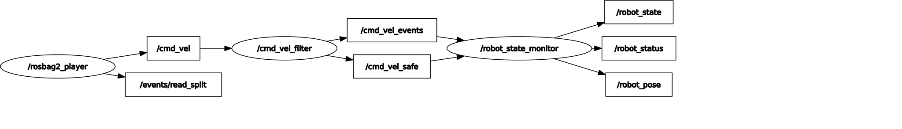

# 103
navigation homework

# cmd_vel_guard：机器人速度指令处理与状态监控系统

基于 ROS 2 Humble（C++）实现。系统读取 `/cmd_vel` 速度指令，进行安全处理后输出安全速度，并实时发布机器人的运动状态、估计位姿与异常统计。

## 系统结构



```
/rosbag2_player
      │ /cmd_vel (geometry_msgs/Twist)
      ▼
cmd_vel_filter ──────────── 安全处理：校验 → 限速 → 加速度限幅 → 超时刹停
      │ /cmd_vel_safe   (geometry_msgs/Twist, 50 Hz)
      │ /cmd_vel_events (std_msgs/String, 事件触发)
      ▼
robot_state_monitor ─────── 状态判定、位姿积分、异常统计
      │ /robot_state  (std_msgs/String, 10 Hz)
      │ /robot_pose   (geometry_msgs/Pose2D, 10 Hz)
      │ /robot_status (std_msgs/String, 1 Hz)
```

> rqt_graph 中的 `/events/read_split` 是 rosbag2 播放器自带的内部 topic，与本系统无关。

## 节点说明

### cmd_vel_filter：安全处理

订阅 `/cmd_vel`，对每条指令依次处理：

1. **非法值检查**：任一字段为 NaN 或 ±inf 时，整条消息丢弃，发布 `INVALID` 事件。
2. **限速**：线速度、角速度超过上限时裁剪到上限，发布 `CLAMPED` 事件。
3. **加速度限幅**：定时器以 50 Hz 让输出速度逐步逼近目标值，每周期变化量不超过 `max_accel × dt`，避免速度跳变。
4. **超时刹停（看门狗）**：超过 `timeout` 秒未收到有效指令时，目标速度归零并平滑减速，发布 `TIMEOUT` 事件；数据恢复后发布 `RECOVERED` 事件。

订阅回调只更新**目标值**，由定时器以固定频率发布**输出值**。因此即使输入中断，`/cmd_vel_safe` 也会持续发布（逐渐减速至 0），下游始终能确认安全层在正常工作。

### robot_state_monitor：状态监控

订阅 `/cmd_vel_safe` 与 `/cmd_vel_events`，按以下优先级判定状态：

| 状态 | 条件 |
|---|---|
| `FILTER_LOST` | 超过 `input_timeout` 未收到 `/cmd_vel_safe`，说明安全层本身失效 |
| `TIMEOUT` | 收到 `TIMEOUT` 事件且尚未恢复 |
| `TURNING` | 平移与旋转同时存在 |
| `MOVING` | 只有平移 |
| `ROTATING` | 只有旋转（原地转向） |
| `IDLE` | 速度均低于阈值 |

此外，节点对安全速度积分得到位姿 `(x, y, θ)` 与累计行驶距离，并统计各类异常的次数，每秒在 `/robot_status` 上发布一次汇总，例如：

```
state=MOVING v=0.30,0.40 w=0.00 pose=(5.12,1.03,0.42) dist=7.85 invalid=2 clamped=31 timeout=1
```

## Topic 一览

| Topic | 类型 | 发布者 | 说明 |
|---|---|---|---|
| `/cmd_vel` | `geometry_msgs/Twist` | rosbag | 原始速度指令 |
| `/cmd_vel_safe` | `geometry_msgs/Twist` | cmd_vel_filter | 安全处理后的速度，50 Hz |
| `/cmd_vel_events` | `std_msgs/String` | cmd_vel_filter | `INVALID` / `CLAMPED` / `TIMEOUT` / `RECOVERED` |
| `/robot_state` | `std_msgs/String` | robot_state_monitor | 当前运动状态，10 Hz |
| `/robot_pose` | `geometry_msgs/Pose2D` | robot_state_monitor | 积分估计的位姿，10 Hz |
| `/robot_status` | `std_msgs/String` | robot_state_monitor | 状态、速度、位姿、异常统计汇总，1 Hz |

## 参数

参数集中在 `config/params.yaml`，修改后重新 `colcon build` 即可生效，无需修改代码。

| 节点 | 参数 | 默认值 | 说明 |
|---|---|---|---|
| cmd_vel_filter | `max_linear_speed` | 1.0 m/s | 线速度上限 |
| | `max_angular_speed` | 1.5 rad/s | 角速度上限 |
| | `max_linear_accel` | 1.0 m/s² | 线加速度上限 |
| | `max_angular_accel` | 3.0 rad/s² | 角加速度上限 |
| | `timeout` | 0.5 s | 输入超时阈值 |
| | `allow_lateral` | true | 是否允许横向速度（全向底盘为 true，差速底盘为 false） |
| | `publish_rate` | 50.0 Hz | 输出频率 |
| robot_state_monitor | `idle_linear_threshold` | 0.01 m/s | 判定静止的线速度阈值 |
| | `idle_angular_threshold` | 0.01 rad/s | 判定静止的角速度阈值 |
| | `input_timeout` | 0.5 s | 判定 `FILTER_LOST` 的阈值 |
| | `state_rate` | 10.0 Hz | 状态发布频率 |

## 数据集中的异常及处理

对所给 rosbag（320 条消息，约 35.9 s）逐帧解析后，发现以下异常：

| 时间 | 数据 | 问题 | 处理结果 |
|---|---|---|---|
| 19.0–21.9 s | linear.x = 2.5，angular.z = 3.0 | 超速 | 裁剪为 1.0 m/s、1.5 rad/s，产生 30 次 `CLAMPED` |
| 22.0 s | linear.x = NaN | 非法值 | 整帧丢弃，`INVALID` |
| 22.5 s | angular.z = inf | 非法值 | 整帧丢弃，`INVALID` |
| 23.0 s | linear.x = -2.2（前后帧均为 +0.25） | 单帧尖峰 | 先裁剪为 -1.0，再经加速度限幅，输出仅下降约 0.1 m/s，下一帧即恢复 |
| 12.0 s、16.0 s | 0.8 → 0.5、0.5 → -0.35 | 速度突变（含前进直接切换为后退） | 加速度限幅平滑过渡 |
| 24.0–27.9 s | linear.y = 0.4 | 横向速度 | 由 `allow_lateral` 决定保留或置零 |
| 27.9–32.0 s | 4.1 s 无消息 | 输入中断 | 0.5 s 后触发 `TIMEOUT` 并刹停，32.0 s 时 `RECOVERED` |

### 为什么 NaN / inf 需要单独处理

- NaN 参与的比较运算结果恒为 false，`if (v > max)` 这类限速判断会让 NaN 原样通过，因此必须先用 `std::isfinite()` 检查。
- NaN 具有传染性，一旦进入位姿积分或 PID 积分项，后续结果将全部变为 NaN。
- inf 若按普通超速处理，会被裁剪为最大速度，相当于把一条错误指令变成全速运动。上游出现非法值意味着计算已经出错，正确的做法是不信任这条指令。

## 设计取舍

- **整帧丢弃而非逐字段修复**：22.0 s 那一帧中 angular.z = -0.25 是合法的，但同一帧中出现非法字段说明上游计算出错，其余字段同样不可信。
- **丢弃坏帧后沿用上一帧目标**：坏帧不刷新超时计时器。因此偶发坏帧不影响运动，持续的坏数据会在 `timeout` 后触发刹停。
- **监控节点也监控上游**：`FILTER_LOST` 用于检测安全层自身失效，这比输入中断更严重。
- **位姿基于指令速度积分**：由于没有编码器或真实里程计，`/robot_pose` 表示"按指令应到达的位置"，仅作为估计值。

## 运行方法

环境：Ubuntu 22.04 + ROS 2 Humble。

```bash
# 1. 克隆到工作空间的 src 目录下
cd ~/ros2_ws/src
git clone https://github.com/fengshihao39/103.git

# 2. 编译
cd ~/ros2_ws
colcon build --packages-select cmd_vel_guard
source install/setup.bash

# 3. 运行（启动两个节点，2 秒后自动播放 bag）
ros2 launch cmd_vel_guard cmd_vel_guard.launch.py bag_path:=/path/to/cmd_vel
```

rosbag 文件体积原因未纳入仓库，请将题目提供的 bag 解压后通过 `bag_path` 指定路径（即包含 `metadata.yaml` 的文件夹）。

Launch 参数：

| 参数 | 默认值 | 说明 |
|---|---|---|
| `bag_path` | `/ws/ros2/src/103/bags/cmd_vel` | rosbag 路径 |
| `play_bag` | `true` | 是否自动播放 bag |
| `rqt_graph` | `false` | 是否同时打开 rqt_graph |

查看输出：

```bash
ros2 topic echo /cmd_vel_events
ros2 topic echo /robot_status
```

## 运行结果

运行一次完整的 bag，状态变化如下（时间为 bag 内时间）：

```
0 s     IDLE
3 s     IDLE    → MOVING      开始前进
12 s    MOVING  → TURNING     转弯
16 s    TURNING → MOVING      后退
19 s    MOVING  → TURNING     超速段（已限速），伴随 CLAMPED 事件
22 s                          INVALID ×2（NaN、inf）
24 s    TURNING → MOVING      横向移动
28.3 s  MOVING  → TIMEOUT     输入中断，刹停
32 s    TIMEOUT → MOVING      数据恢复
35.5 s  MOVING  → IDLE        指令归零，停车
36.3 s  IDLE    → TIMEOUT     bag 结束，无输入
```


> 终端日志使用 `RCLCPP_WARN_THROTTLE` 限制为每秒最多一条，完整事件以 `/cmd_vel_events` topic 为准。

## 调试中发现的问题

开发过程中曾同时运行了两份 launch，导致两个 `cmd_vel_filter` 同时向 `/cmd_vel_safe` 发布消息。monitor 的状态在 `IDLE` 和 `TURNING` 之间频繁跳变，且由于第二份 bag 填补了数据中断，`TIMEOUT` 没有被触发。这说明同一 topic 存在多个发布者时，下游无法区分数据来源。可用 `ros2 node list` 或 `ros2 topic info /cmd_vel_safe` 检查发布者数量。

## 可改进方向

- 尖峰检测：对 23.0 s 那类单帧突变，可通过与前后帧对比或中值滤波直接剔除，并发布 `SPIKE` 事件。
- 发布者数量检测：monitor 定期检查 `/cmd_vel_safe` 的发布者数量，超过 1 个时报警。
- 使用 `nav_msgs/Odometry` 替代 `Pose2D`，便于在 RViz 中显示轨迹。
- 支持 `use_sim_time`，使超时判断基于 bag 时间，从而支持倍速回放。

## 目录结构

```
103/
├── README.md
├── docs/
│   └── rosgraph.svg
└── cmd_vel_guard/
    ├── CMakeLists.txt
    ├── package.xml
    ├── config/
    │   └── params.yaml
    ├── launch/
    │   └── cmd_vel_guard.launch.py
    └── src/
        ├── cmd_vel_filter.cpp
        └── robot_state_monitor.cpp
```
